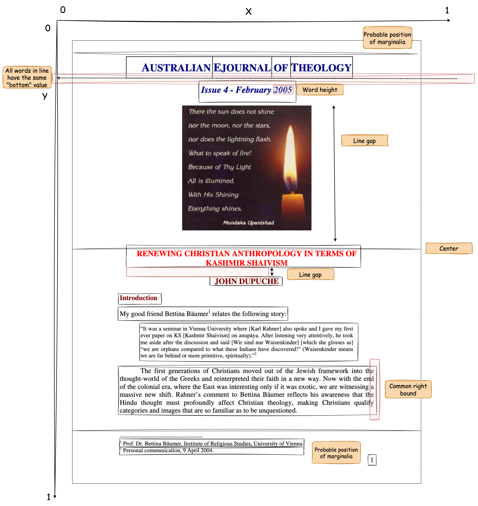

# Solution

## Algorithm

The primary strategy:

1. Calculate statistics for the document (e.g., common word height).
2. Group all words into lines using heuristics.
3. Group all lines into blocks using heuristics.
4. Classify each block using heuristics.

### Heuristics

Here is the list of heuristics that are used to solve the problem:

